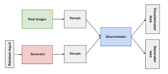
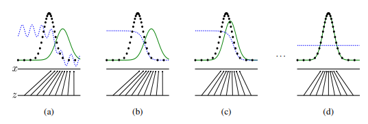
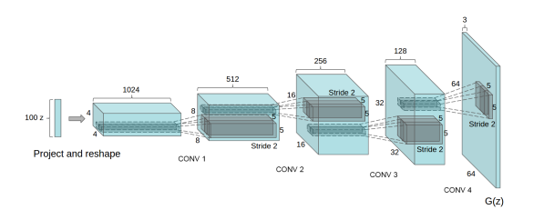

# GAN STUDY

이 문서는 하단 REFERENCE 탭에 있는 1시간 만에 GAN 완벽 정복하기와 DCGAN 딥러닝 홀로서기 라는 영상 자료와 논문 [DCGAN PAPER]([https://arxiv.org/pdf/1511.06434.pdf](https://arxiv.org/pdf/1511.06434.pdf), [Generative Adversarial Networks]([https://arxiv.org/pdf/1406.2661.pdf](https://arxiv.org/pdf/1406.2661.pdf) 과 블로그를 포함한 여러 글을 참고하며 공부한 내용을 토대로 정리한 문서임을 밝힙니다.

## GAN의 구조

gan의 구조를 보면 다음과 같다.



[Discriminative Model]([https://en.wikipedia.org/wiki/Discriminative_model](https://en.wikipedia.org/wiki/Discriminative_model)은 주어진 통계(데이터)에서 어떻게 분류할지를 학습하는 모델이고, Generator Model은 데이터의 분포를 학습하는 모델이다.



이미지 출처 - [https://arxiv.org/pdf/1406.2661.pdf](https://arxiv.org/pdf/1406.2661.pdf)

검은 선 : 실제 데이터의 분포

초록 선 : Generator의 분포

파란 선 : Discriminative의 분포

점차 학습을 해가는 과정

Generator Model이 학습을 잘했는지를 알기 위해서 분포를 보는 것인데, 예를 들어 성인 남성의 키와 몸무게 데이터를 학습시키는 모델에서 키가 180cm, 몸무게가 40kg 라면 그 모델은 학습을 제대로 하지 못했다고 볼 수 있다. 하지만 실제 데이터와 유사한 형태로 나온다면, 학습을 잘 했다고 볼 수 있는 것 이다.

## 학습하는 과정

$$
\min _{G} \max _{D} V(D, G)=E_{x \sim p_{\text {data }}(x)}[\log D(x)]+E_{z \sim p_{z}(z)}[\log \{1-D(G(z))\}]
$$

Discriminative는

$E_{x \sim p_{\text {data}}(x)}[\log D(x)]$

D(x)=1 일 때 가장 커지게 된다. 실제 데이터를 넣으면 높은 확률이 나오게 한다.

$E_{z \sim p_{z}(z)}[\log \{1-D(G(z))\}]$

D(x)=0 일 때 가장 커지게 되므로, 가짜 데이터를 넣으면 낮은 확률이 나오게 업데이트 한다.

Generator는

$E_{z \sim p_{z}(z)}[\log {1-D(G(z))}]$

z는 가우시안 분포로 뽑은 샘플 데이터

D(G(z)) = 1 일 때 가장 작아지므로, 가짜 데이터를 D에 넣었을 때, 진짜 처럼 인식하게 한다. 

## DCGAN



기존 gan의 fully-connected 구조를 cnn으로 대체한 모델이다. 

변경점은 다음과 같다.

+ discriminator에서 pooling layers를 strided convolutions로 바꾼다.

+ generator에서 pooling layers를 fractional-strided convolutions로 바꾼다.

+ generator와 discriminator에서 batch-normalization를 사용한다.

+ fully connected hidden layers를 삭제한다.

+ generator에서 활성화 함수로 ReLU를 사용하고, 마지막에서 하이퍼볼릭 탄젠트를 사용한다.

+ discriminator에서 LeakyReLU를 사용한다.

원문은 다음과 같다.

> Architecture guidelines for stable Deep Convolutional GANs
> • Replace any pooling layers with strided convolutions (discriminator) and fractional-strided
> convolutions (generator).
> • Use batchnorm in both the generator and the discriminator.
> • Remove fully connected hidden layers for deeper architectures.
> • Use ReLU activation in generator for all layers except for the output, which uses Tanh.
> • Use LeakyReLU activation in the discriminator for all layers.

## KERAS CODE 분석

### DCGAN.PY

[https://github.com/eriklindernoren/Keras-GAN/blob/master/dcgan/dcgan.py](https://github.com/eriklindernoren/Keras-GAN/blob/master/dcgan/dcgan.py)

DCGAN클래스를 선언한다.

mnist를 사용한다. gray scale에 해당하기에 `channels`의 값을 1로 설정한다. (28,28,1)

가우시안 분포를 뽑을 `latent_dim`는 100으로  설정한다. 후에 generator에 입력한다.

```python
z = Input(shape=(self.latent_dim,))
```

`optimizer`는 `Adam`을 사용한다. 

`loss` 함수는 `binary_crossentropy`를 사용한다.

`discriminator` 와 `generator` 를 함수를 통해서 만들고 `self.combined` 로 병합한다.

병합한 모델의 loss 함수와 optimizer는 discriminator의 설정과 같다.

함수는 __init__과 메인을 제외하고 4가지의 함수가 있다.

`build_generator` 는 generator모델을 선언하고, noise를 입력받아 노이즈와 모델에 넣은 값을 리턴한다.

`build_discriminator` 는 discriminator 모델을 선언하고, 이미지를 입력받아 이미지와 모델에 넣은 값을 리턴한다.

`train` 은 mnist 데이터를 로드하고 -1~1 값으로 rescale 하고 이후 학습시킨다.

`save_imgs` 는 epoch에 따라 이미지를 저장한다.


### ## **02_DCGAN_CIFAR10.ipynb**

[https://github.com/mafda/generative_adversarial_networks_101/blob/master/src/cifar10/02_DCGAN_CIFAR10.ipynb](https://github.com/mafda/generative_adversarial_networks_101/blob/master/src/cifar10/02_DCGAN_CIFAR10.ipynb)

`np.clip(arr,min,max)` 은 min보다 작은 값의 수를 min으로, max 보다 큰 값의 수를 max로 변환한다.

`generator` 모델은 DCGAN의 논문에서 제시한 모델 처럼 4개의 `Conv2DTranspose` 레이어를 사용했다. `Conv2DTranspose`는  `Conv2d` 레이어가 하는 일을 반대로 하는 전치 컨볼루션 레이어이다.

논문에서는 가우시안 분포로 100, reshape 해서 1024, con2dTranspose로 512, 256, 128, 마지막 3 의 크기를 가졌지만, 코드에서는 마지막 레이어를 제외하고 2배씩 더 컸다.

활성화 함수로는 논문에서 제시한 `LeakyReLU` 와 `tanh` 함수를 사용했다.

`discriminator` 모델은 4개의 `Conv2D` 레이어를 사용했고, 마지막 `Flatten` 으로 일렬화를 하고, sigmoid를 통해 0~1 까지 이미지가 페이크 이미지인지를 판별한다.

활성화 함수는 `LeakyReLU` 를 사용했다.

옵티마이저는 `Adam` 을 사용했고, 평범한 이진 분류 형태다.

이후 가우시안 분포로 z를 뽑고, `generator` 에 z를 넣은 값과 생성된 이미지를 `discriminator` 에 넣은 값을 입력, 출력 값으로 갖는 모델을 만든다.

```python
d_g = Model(inputs=z, outputs=decision)
```

이후 실제 이미지를 선별해 `discriminator` 에 넣어 loss를 얻고, 페이크 이미지도 같은 작업을 거친다. 이후 리스트에 추가해 출력하고, 랜덤으로 값을 가져와 이미지를 만들고 `plt.imshow` 로 보여준다.


# REFERENCE

[[#34.Lab] DCGAN Code WalkThrough - 딥러닝 홀로서기]([https://www.youtube.com/watch?v=JOjMk-E1CnQ&t=1001s](https://www.youtube.com/watch?v=JOjMk-E1CnQ&t=1001s)

[# 1시간만에 GAN(Generative Adversarial Network) 완전 정복하기]([https://www.youtube.com/watch?v=odpjk7_tGY0&t=2695s](https://www.youtube.com/watch?v=odpjk7_tGY0&t=2695s)

[DCGAN 논문 이해하기]([https://angrypark.github.io/generative%20models/paper%20review/DCGAN-paper-reading/](https://angrypark.github.io/generative%20models/paper%20review/DCGAN-paper-reading/)

[https://ratsgo.github.io/generative%20model/2017/12/20/gan/](https://ratsgo.github.io/generative%20model/2017/12/20/gan/)
