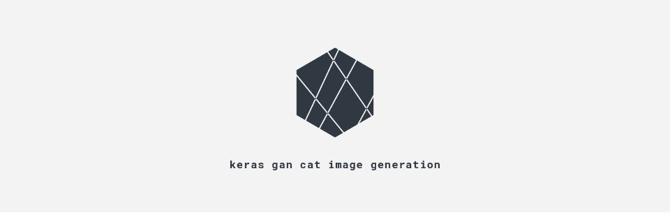
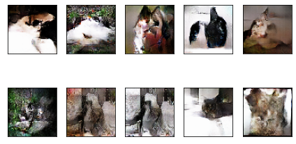
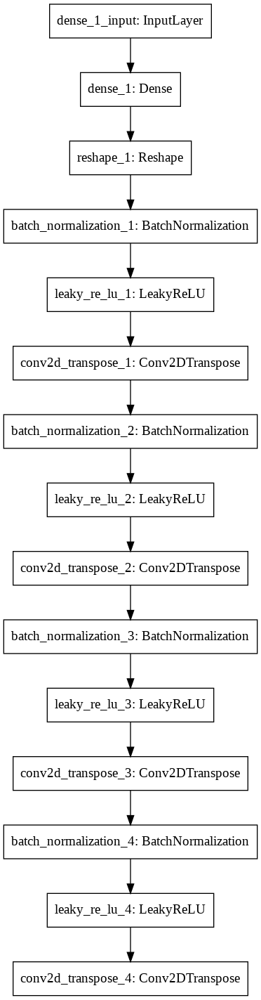
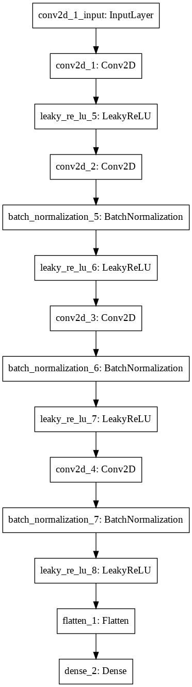

# keras gan cat image generation

  

GAN을 공부하면서 많은 도움을 받은 [02_DCGAN_CIFAR10.ipynb](https://github.com/mafda/generative_adversarial_networks_101/blob/master/src/cifar10/02_DCGAN_CIFAR10.ipynb)를 참고하여 프로젝트를 진행했습니다. 자세한 내용은 [GAN_STUDY](GAN_STUDY.md) 문서를 참고해 주십시오.

  

## 모델 구조

이미지의 크기는 (64,64,3) 입니다.

**generator**

**discriminator**

